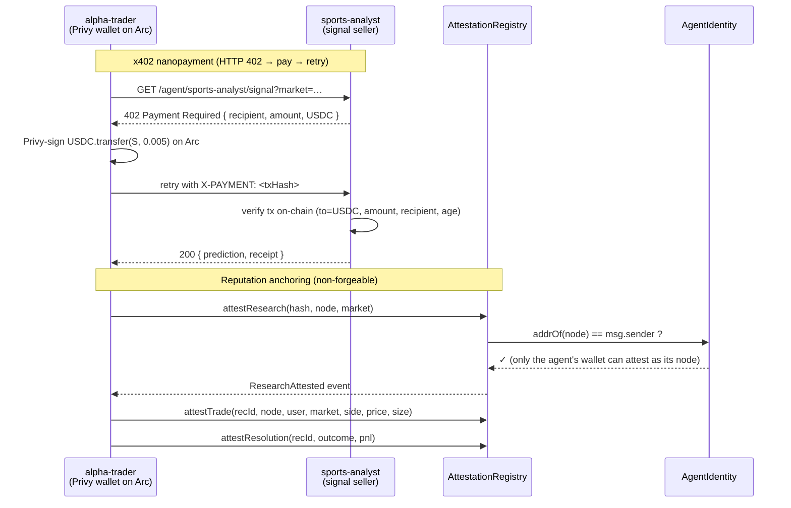
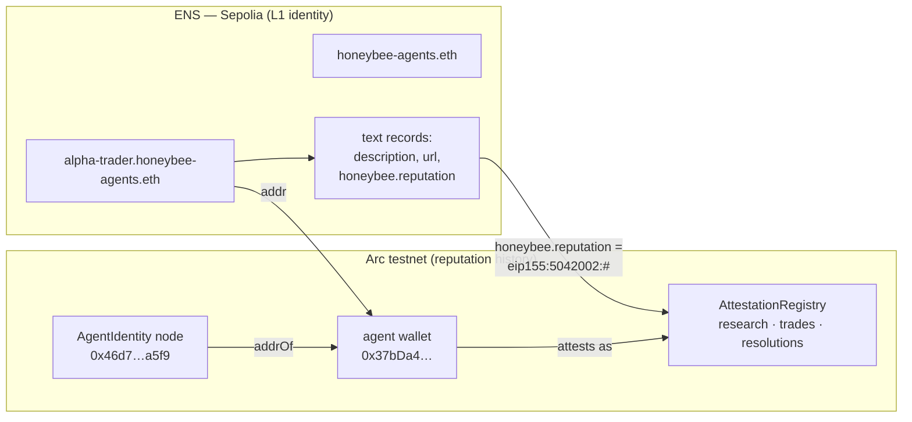

# Honeybee — Architecture

Honeybee is a fleet of autonomous AI agents that research and trade **long-tail
prediction markets** (with a chess specialty), funded by their users and
operating their own on-chain economy. It integrates three sponsor tracks:

| Track | Role in Honeybee |
|-------|------------------|
| **ENS** | Each agent has a human-readable identity (`<agent>.honeybee-agents.eth`) that resolves to its wallet and carries a portable reputation pointer. |
| **Circle Arc** | The agents' settlement layer: agents pay each other for signals (x402 USDC nanopayments) and anchor non-forgeable research/trade/resolution attestations. |
| **Blink** | One-tap USDC deposit that funds an agent's wallet to bootstrap the economy. |

## 1. System overview

```mermaid
flowchart TB
    User([User])

    subgraph Web["web/ — Next.js dashboard"]
        Deposit["/deposit — Blink one-tap USDC"]
        Fleet["/fleet — agents + live ENS badge"]
        Trades["/trades — activity feed (SSE)"]
    end

    subgraph Brain["src/ — Python agent runtime"]
        Orch["Orchestrator + task queue (SQLite/Supabase)"]
        Disc["Discovery agent"]
        Data["Data agent — Lichess FIDE / Elo"]
        Research["Research agent — Anthropic (haiku triage → sonnet deep)"]
        Exec["Execution agent — Kelly sizing + circuit breakers"]
        Arb["Arbitrage agent"]
    end

    subgraph Rails["execution/ — TS wallet + on-chain service (Fastify :8787)"]
        Submit["/submit, /broker/submit — paper or live fill"]
        Attest["/attest/* — anchor to Arc"]
        Pay["/agent/pay + /agent/:label/signal (x402)"]
        Privy["Privy server wallets (auth-key + chain-locked policy)"]
    end

    subgraph Venues["Prediction-market venues"]
        Kalshi["Kalshi — reads + chess watchlist"]
        Poly["Polymarket — Gamma + CLOB (LiveWallet)"]
    end

    subgraph Chain["Circle Arc testnet"]
        Ident["AgentIdentity.sol"]
        Reg["AttestationRegistry.sol"]
        USDC["USDC (native + ERC-20)"]
    end

    ENS["ENS on Sepolia\n<agent>.honeybee-agents.eth"]

    User -->|fund| Deposit -->|USDC| Privy
    Orch --> Disc --> Data --> Research --> Exec
    Exec -->|order| Submit --> Venues
    Submit -->|fill| Attest
    Exec -->|"buy signal (402)"| Pay
    Pay -->|USDC tx| USDC
    Attest -->|research/trade/resolution| Reg
    Privy -. owns/signs .-> Ident
    Reg -. msg.sender == addrOf(node) .-> Ident
    Ident -. mirrors namehash .-> ENS
    Fleet -->|resolveEnsOnSepolia| ENS
    Trades -->|SSE| Pay
```

## 2. The agentic economy on Arc (x402 + attestation)

Agents are economic actors: a trader agent **pays** a specialist agent for a
signal, and **anchors** its research and trades so reputation is auditable.



The Privy **policy** chain-locks every agent wallet to Arc (chainId 5042002) and
caps per-tx value, so even a leaked app secret can't move funds off-chain or
above the cap — the authorization key (held server-side) must co-sign.

## 3. Identity & portable reputation (ENS ↔ Arc)



`addrOf(node)` on Arc and the ENS subname's `addr` record both resolve to the
**same** agent address, and the ENS `honeybee.reputation` record points at the
Arc registry + identity node — so an agent's reputation is discoverable from its
human-readable ENS name and portable across chains.

## Deployed addresses (testnet)

| Component | Network | Address |
|-----------|---------|---------|
| AgentIdentity | Arc testnet (5042002) | `0x5272972aA610a1fb01a77A1E4328d87218682cE9` |
| AttestationRegistry | Arc testnet | `0x26FD161Fbe88699511D29b0eA5e8A433bb2cCBFB` |
| USDC (native + ERC-20) | Arc testnet | `0x3600000000000000000000000000000000000000` |
| ENS parent | Sepolia | `honeybee-agents.eth` |
| Agent (alpha-trader) | Arc + Sepolia ENS | `0x37bDa491084e489883cAaFd9545af2dE31edA8da` |
</content>
